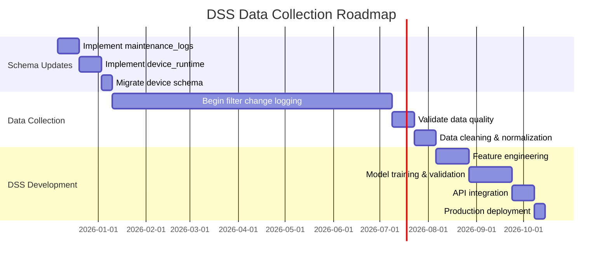

# DATA AUDIT REPORT
## Pre-DSS Implementation: Data & Schema Assessment

**Date:** December 6, 2025  
**Project:** Water Quality Monitoring System - DSS Integration  
**Purpose:** Comprehensive audit of existing data infrastructure before implementing filter change prediction DSS

---

## EXECUTIVE SUMMARY

### Critical Findings
🔴 **BLOCKER**: No maintenance/filter change data exists in current system  
🔴 **BLOCKER**: No operational hours or runtime tracking implemented  
🟡 **WARNING**: Device metadata lacks essential fields for DSS training  
🟡 **WARNING**: No historical maintenance logs or service records  
🟢 **READY**: Sensor data infrastructure is mature and well-indexed  

### Recommendation
**CANNOT PROCEED with DSS implementation until:**
1. Maintenance log collection is designed and implemented
2. Device operational metrics tracking is added
3. 6-12 months of historical filter change data is collected
4. Device registration schema is enhanced with filter-specific metadata

---

## 1. DATABASE INVENTORY

### 1.1 Existing Collections (5 total)

| Collection | Purpose | Document Count | Data Quality | DSS Relevance |
|------------|---------|---------------|--------------|---------------|
| `users` | User authentication & authorization | Unknown | ✅ Good | ❌ None |
| `devices` | Device registry & status | Unknown | ⚠️ Partial | 🟡 Medium |
| `sensorreadings` | High-volume time-series sensor data | Unknown (High) | ✅ Good | 🟢 High |
| `alerts` | Water quality threshold violations | Unknown | ✅ Good | 🟡 Low-Medium |
| `reports` | Generated PDF/CSV reports | Unknown | ✅ Good | ❌ None |

### 1.2 Missing Collections (CRITICAL)

| Missing Collection | Purpose | Priority | Estimated Impact |
|-------------------|---------|----------|-----------------|
| `maintenance_logs` | Filter changes, service events | 🔴 CRITICAL | **BLOCKS DSS** |
| `device_runtime` | Operating hours, uptime tracking | 🔴 CRITICAL | **BLOCKS DSS** |
| `filter_inventory` | Filter types, models, specs | 🔴 HIGH | **BLOCKS DSS** |
| `performance_metrics` | Flow rate, pressure, efficiency | 🟡 MEDIUM | Reduces accuracy |
| `calibration_logs` | Sensor calibration history | 🟡 LOW | Data quality validation |

---

## 2. SCHEMA ANALYSIS

### 2.1 DEVICES Collection

#### Current Schema
```typescript
{
  _id: ObjectId,
  deviceId: String (unique, indexed),
  name: String,
  type: String (default: 'water-quality-sensor'),
  firmwareVersion: String,
  macAddress: String,
  ipAddress: String,
  sensors: [String],
  location: String,
  status: Enum ['online', 'offline'],
  registrationStatus: Enum ['registered', 'pending'],
  isRegistered: Boolean,
  lastSeen: Date,
  metadata: {
    location: {
      building: String,
      floor: String,
      notes: String
    },
    firmware: String,
    hardware: String,
    ipAddress: String
  },
  // Soft delete fields
  isDeleted: Boolean,
  deletedAt: Date,
  deletedBy: ObjectId (ref: users),
  scheduledPermanentDeletionAt: Date,
  createdAt: Date,
  updatedAt: Date
}
```

#### Indexes
- Single: `deviceId`, `status`, `registrationStatus`, `isRegistered`, `isDeleted`
- Compound: `{status, lastSeen}`, `{registrationStatus, createdAt}`, `{isRegistered, status}`

#### Data Gaps for DSS

| Missing Field | Type | Purpose | Impact |
|--------------|------|---------|--------|
| `filterType` | String | Filter model/type identifier | **CRITICAL** - Cannot group devices |
| `filterModel` | String | Specific filter SKU | **CRITICAL** - Cannot predict by model |
| `installationDate` | Date | Device commissioning date | **HIGH** - Cannot calculate lifetime |
| `lastFilterChange` | Date | Most recent filter replacement | **CRITICAL** - No baseline for prediction |
| `filterChangeHistory` | [ObjectId] | Refs to maintenance_logs | **CRITICAL** - No training data |
| `operatingHoursAtLastChange` | Number | Runtime at last filter change | **CRITICAL** - Cannot model degradation |
| `totalOperatingHours` | Number | Cumulative runtime | **HIGH** - Key feature for ML |
| `expectedFilterLifespan` | Number | Manufacturer spec (hours) | **MEDIUM** - Baseline comparison |
| `filterCapacity` | Number | Volume capacity (liters) | **MEDIUM** - Alternative metric |
| `waterThroughput` | Number | Total water processed | **MEDIUM** - Usage-based prediction |

#### Data Quality Issues
- ❌ **No validation** for `deviceId` format consistency
- ❌ **No constraints** on sensor array values
- ⚠️ `location` is free-text (inconsistent formatting likely)
- ⚠️ `type` field has default but no enum constraint
- ⚠️ `metadata` is loosely structured (no validation)

---

### 2.2 SENSOR READINGS Collection

#### Current Schema
```typescript
{
  _id: ObjectId,
  deviceId: String (indexed),
  pH: Number | null,
  turbidity: Number | null,
  tds: Number | null,
  pH_valid: Boolean,
  tds_valid: Boolean,
  turbidity_valid: Boolean,
  timestamp: Date (indexed),
  // Soft delete fields
  isDeleted: Boolean,
  deletedAt: Date,
  deletedBy: ObjectId (ref: users),
  scheduledPermanentDeletionAt: Date,
  createdAt: Date
}
```

#### Indexes
- Single: `deviceId`, `timestamp`, `isDeleted`
- Compound: `{deviceId, timestamp}`, `{timestamp, deviceId}` (optimized for time-series)

#### Strengths
✅ **High-volume optimized** with proper time-series indexing  
✅ **Validity flags** for graceful sensor degradation handling  
✅ **Nullable values** allow partial data capture  
✅ **Timestamp precision** suitable for trend analysis  

#### Limitations for DSS
- ❌ **No flow rate** data (water volume processed)
- ❌ **No pressure differential** (filter clogging indicator)
- ❌ **No temperature** (affects sensor calibration)
- ❌ **No humidity** (environmental context)
- ⚠️ **No aggregated metrics** (hourly/daily summaries stored separately)

#### Data Volume Estimation
Assuming 30-second reading intervals:
- **2 readings/minute** × 60 min × 24 hr = **2,880 readings/device/day**
- For 10 devices: **28,800 readings/day** = **864,000 readings/month**
- **10.4M readings/year** across all devices

**Storage Impact:** ~200 bytes/doc × 10.4M = **~2 GB/year** (raw data only)

---

### 2.3 ALERTS Collection

#### Current Schema
```typescript
{
  _id: ObjectId,
  alertId: String (unique, UUID format),
  deviceId: String (indexed),
  deviceName: String,
  deviceLocation: String,
  severity: Enum ['Critical', 'Warning', 'Advisory'],
  parameter: Enum ['pH', 'Turbidity', 'TDS'],
  value: Number,
  threshold: Number,
  message: String,
  status: Enum ['Unacknowledged', 'Acknowledged', 'Resolved'],
  acknowledgedAt: Date,
  acknowledgedBy: ObjectId (ref: users),
  resolvedAt: Date,
  resolvedBy: ObjectId (ref: users),
  resolutionNotes: String,
  timestamp: Date,
  acknowledged: Boolean,
  occurrenceCount: Number,
  firstOccurrence: Date,
  lastOccurrence: Date,
  currentValue: Number,
  emailSent: Boolean,
  emailSentAt: Date,
  // Soft delete fields
  isDeleted: Boolean,
  deletedAt: Date,
  deletedBy: ObjectId,
  scheduledPermanentDeletionAt: Date,
  createdAt: Date,
  updatedAt: Date
}
```

#### Relevance to DSS
🟡 **MEDIUM** - Alerts may correlate with filter degradation:
- High turbidity alerts → clogged filter
- Multiple parameter alerts → system deterioration
- Alert frequency increase → maintenance needed

#### Potential DSS Features
- `alertCount_last30days` - Recent alert activity
- `avgTimeBetweenAlerts` - Degradation rate indicator
- `criticalAlertRatio` - System health metric
- `parameterAlertDistribution` - Which sensors degrade first

---

### 2.4 REPORTS Collection

#### Current Schema
```typescript
{
  _id: ObjectId,
  type: Enum ['water-quality', 'device-status', 'compliance', 'alert-summary', 'custom'],
  title: String,
  description: String,
  status: Enum ['generating', 'completed', 'failed'],
  format: Enum ['pdf', 'csv', 'excel'],
  parameters: Mixed,
  file: {
    fileId: ObjectId,
    filename: String,
    format: String,
    size: Number,
    mimeType: String
  },
  generatedBy: ObjectId (ref: users),
  generatedAt: Date,
  errorMessage: String,
  expiresAt: Date (TTL indexed),
  createdAt: Date,
  updatedAt: Date
}
```

#### DSS Relevance
❌ **NONE** - Reports are output artifacts, not input data

---

## 3. DATA QUALITY ASSESSMENT

### 3.1 Device Data Completeness

**Query Needed to Assess:**
```javascript
db.devices.aggregate([
  {
    $project: {
      deviceId: 1,
      hasName: { $ne: ["$name", ""] },
      hasLocation: { $ne: ["$location", ""] },
      hasFirmware: { $ne: ["$firmwareVersion", ""] },
      hasMacAddress: { $ne: ["$macAddress", ""] },
      hasIPAddress: { $ne: ["$ipAddress", ""] },
      hasSensors: { $gt: [{ $size: "$sensors" }, 0] },
      hasMetadata: { $ne: ["$metadata", {}] },
      registrationComplete: "$isRegistered",
      lastSeenRecent: { $gte: ["$lastSeen", new Date(Date.now() - 2*60*1000)] }
    }
  },
  {
    $group: {
      _id: null,
      total: { $sum: 1 },
      completeRecords: { $sum: { $cond: [
        { $and: [
          "$hasName", "$hasLocation", "$hasFirmware", 
          "$hasMacAddress", "$hasIPAddress", "$hasSensors",
          "$registrationComplete"
        ]}, 1, 0
      ]}},
      onlineDevices: { $sum: { $cond: ["$lastSeenRecent", 1, 0] }}
    }
  }
])
```

**Expected Issues:**
- Unregistered/pending devices with incomplete metadata
- Offline devices with stale `lastSeen` timestamps
- Missing location data (free-text field prone to omission)
- Empty sensor arrays for uninitialized devices

---

### 3.2 Sensor Data Quality

#### Validity Flags Analysis
**Query to check sensor health:**
```javascript
db.sensorreadings.aggregate([
  {
    $match: {
      timestamp: { $gte: new Date(Date.now() - 30*24*60*60*1000) } // Last 30 days
    }
  },
  {
    $group: {
      _id: "$deviceId",
      totalReadings: { $sum: 1 },
      validPH: { $sum: { $cond: ["$pH_valid", 1, 0] }},
      validTDS: { $sum: { $cond: ["$tds_valid", 1, 0] }},
      validTurbidity: { $sum: { $cond: ["$turbidity_valid", 1, 0] }},
      nullPH: { $sum: { $cond: [{ $eq: ["$pH", null] }, 1, 0] }},
      nullTDS: { $sum: { $cond: [{ $eq: ["$tds", null] }, 1, 0] }},
      nullTurbidity: { $sum: { $cond: [{ $eq: ["$turbidity", null] }, 1, 0] }}
    }
  },
  {
    $project: {
      deviceId: "$_id",
      totalReadings: 1,
      phValidityRate: { $divide: ["$validPH", "$totalReadings"] },
      tdsValidityRate: { $divide: ["$validTDS", "$totalReadings"] },
      turbidityValidityRate: { $divide: ["$validTurbidity", "$totalReadings"] },
      phNullRate: { $divide: ["$nullPH", "$totalReadings"] },
      tdsNullRate: { $divide: ["$nullTDS", "$totalReadings"] },
      turbidityNullRate: { $divide: ["$nullTurbidity", "$totalReadings"] }
    }
  }
])
```

**Quality Thresholds for DSS Training:**
- ✅ **Good**: >95% validity rate
- ⚠️ **Acceptable**: 85-95% validity rate
- ❌ **Poor**: <85% validity rate (exclude from training)

---

### 3.3 Temporal Data Gaps

#### Missing Data Detection
**Query for gaps in sensor readings:**
```javascript
db.sensorreadings.aggregate([
  { $match: { deviceId: "DEVICE_ID_HERE" }},
  { $sort: { timestamp: 1 }},
  {
    $group: {
      _id: "$deviceId",
      readings: { $push: "$timestamp" }
    }
  },
  {
    $project: {
      gaps: {
        $filter: {
          input: { $range: [1, { $size: "$readings" }] },
          as: "idx",
          cond: {
            $gt: [
              { $subtract: [
                { $arrayElemAt: ["$readings", "$$idx"] },
                { $arrayElemAt: ["$readings", { $subtract: ["$$idx", 1] }] }
              ]},
              5*60*1000 // 5 minute gap threshold
            ]
          }
        }
      }
    }
  }
])
```

**Expected Gaps:**
- Device offline periods
- Network connectivity issues
- Maintenance downtime (if any)
- Data migration gaps

---

## 4. DATA REQUIREMENTS FOR DSS

### 4.1 New Collection: `maintenance_logs`

#### Proposed Schema
```typescript
{
  _id: ObjectId,
  logId: String (unique, auto-generated "MNT-{UUID}"),
  deviceId: String (indexed, ref: devices),
  maintenanceType: Enum [
    'filter_change', 
    'sensor_calibration', 
    'cleaning', 
    'repair', 
    'inspection',
    'preventive_maintenance'
  ],
  
  // Filter-specific fields (when maintenanceType = 'filter_change')
  filterChangeDetails: {
    oldFilterType: String,
    newFilterType: String,
    oldFilterId: String (serial number),
    newFilterId: String (serial number),
    changeReason: Enum [
      'scheduled',
      'performance_degradation',
      'clogged',
      'damaged',
      'expired',
      'upgrade'
    ],
    replacedComponents: [String] // ['pre-filter', 'main-filter', 'post-filter']
  },
  
  // Device state at maintenance time
  deviceState: {
    operatingHours: Number, // CRITICAL - cumulative runtime
    operatingHoursSinceLastChange: Number, // CRITICAL
    waterProcessedLiters: Number, // Alternative metric
    waterProcessedSinceLastChange: Number
  },
  
  // Performance metrics before maintenance
  preMaintenanceMetrics: {
    avgPH_7days: Number,
    avgTurbidity_7days: Number,
    avgTDS_7days: Number,
    alertCount_30days: Number,
    pressureDrop: Number, // If pressure sensors added
    flowRate: Number // If flow sensors added
  },
  
  // Maintenance execution
  performedBy: ObjectId (ref: users),
  performedAt: Date (indexed),
  scheduledDate: Date,
  duration: Number (minutes),
  cost: Number,
  notes: String,
  attachments: [{
    filename: String,
    fileId: ObjectId,
    type: Enum ['photo', 'document', 'invoice']
  }],
  
  // Next maintenance prediction (populated by DSS)
  nextMaintenancePrediction: {
    predictedDate: Date,
    predictedOperatingHours: Number,
    confidence: Number (0-1),
    modelVersion: String,
    generatedAt: Date
  },
  
  // Soft delete fields
  isDeleted: Boolean (default: false),
  deletedAt: Date,
  deletedBy: ObjectId (ref: users),
  
  createdAt: Date,
  updatedAt: Date
}
```

#### Indexes
```javascript
// Primary queries
{ deviceId: 1, performedAt: -1 }
{ maintenanceType: 1, performedAt: -1 }
{ deviceId: 1, maintenanceType: 1, performedAt: -1 }

// DSS training queries
{ deviceId: 1, "filterChangeDetails.changeReason": 1 }
{ "deviceState.operatingHours": 1 }
{ "nextMaintenancePrediction.predictedDate": 1 }
```

---

### 4.2 New Collection: `device_runtime`

#### Proposed Schema
```typescript
{
  _id: ObjectId,
  deviceId: String (indexed, ref: devices),
  
  // Cumulative metrics
  totalOperatingHours: Number,
  totalWaterProcessed: Number (liters),
  totalPowerOnCycles: Number,
  
  // Daily aggregates (for historical analysis)
  date: Date (indexed),
  operatingHoursToday: Number,
  waterProcessedToday: Number,
  uptimePercentage: Number (0-100),
  
  // Hourly snapshots (for detailed analysis)
  hourlySnapshots: [{
    hour: Number (0-23),
    operatingMinutes: Number (0-60),
    waterProcessed: Number,
    avgPH: Number,
    avgTurbidity: Number,
    avgTDS: Number,
    alertsTriggered: Number
  }],
  
  // Session tracking
  lastPowerOn: Date,
  lastPowerOff: Date,
  currentSessionHours: Number,
  
  createdAt: Date,
  updatedAt: Date
}
```

#### Indexes
```javascript
{ deviceId: 1, date: -1 } // Primary query
{ date: 1 } // Time-series queries
{ deviceId: 1, "hourlySnapshots.hour": 1 } // Detailed analysis
```

#### TTL Configuration
```javascript
// Optional: Auto-delete daily records after 2 years
db.device_runtime.createIndex(
  { date: 1 }, 
  { expireAfterSeconds: 730 * 24 * 60 * 60 } // 2 years
)
```

---

### 4.3 New Collection: `filter_inventory`

#### Proposed Schema
```typescript
{
  _id: ObjectId,
  filterType: String (indexed, unique),
  manufacturer: String,
  modelNumber: String,
  
  // Specifications
  specifications: {
    expectedLifespanHours: Number,
    expectedCapacityLiters: Number,
    maxPressureDrop: Number,
    maxFlowRate: Number,
    filterationEfficiency: Number (percentage),
    micronRating: Number
  },
  
  // Compatibility
  compatibleDevices: [String], // Device types
  
  // Inventory tracking
  currentStock: Number,
  reorderPoint: Number,
  leadTimeDays: Number,
  costPerUnit: Number,
  
  // Historical performance (aggregated from maintenance_logs)
  historicalMetrics: {
    avgActualLifespanHours: Number,
    avgReplacementReason: String,
    totalReplacements: Number,
    performanceRating: Number (1-5 stars)
  },
  
  createdAt: Date,
  updatedAt: Date
}
```

---

### 4.4 Enhanced Device Schema (Migration Required)

#### New Fields to Add
```typescript
// Add to devices collection
{
  // Filter tracking
  currentFilterType: String (ref: filter_inventory.filterType),
  currentFilterId: String (serial number),
  lastFilterChange: Date (indexed),
  filterInstallDate: Date,
  nextScheduledFilterChange: Date,
  
  // Operational metrics
  installationDate: Date,
  commissioningDate: Date,
  totalOperatingHours: Number (synced from device_runtime),
  totalWaterProcessed: Number (synced from device_runtime),
  operatingHoursSinceLastFilterChange: Number,
  waterProcessedSinceLastFilterChange: Number,
  
  // Maintenance history summary
  maintenanceHistory: {
    totalFilterChanges: Number,
    lastMaintenanceDate: Date,
    nextMaintenanceDate: Date,
    avgDaysBetweenChanges: Number
  },
  
  // DSS predictions (updated by DSS service)
  dssMetadata: {
    filterHealthScore: Number (0-100),
    predictedDaysUntilChange: Number,
    predictionConfidence: Number (0-1),
    predictionGeneratedAt: Date,
    modelVersion: String,
    riskLevel: Enum ['low', 'medium', 'high', 'critical']
  }
}
```

---

## 5. HISTORICAL DATA REQUIREMENTS

### 5.1 Minimum Training Data

| Metric | Minimum | Recommended | Rationale |
|--------|---------|-------------|-----------|
| **Time Period** | 6 months | 12-18 months | Capture seasonal variations |
| **Filter Changes/Device** | 2 | 4-6 | Establish degradation pattern |
| **Devices in Training Set** | 10 | 20-50 | Model generalization |
| **Sensor Reading Frequency** | 5 min | 1-2 min | Detect rapid degradation |
| **Total Filter Changes** | 20 | 100+ | Statistical significance |

### 5.2 Data Collection Timeline



**TOTAL TIMELINE: ~8-9 months minimum**

---

## 6. DATA QUALITY GATES

### 6.1 Device Readiness Criteria

A device is **DSS-ready** if:
```javascript
{
  // Registration complete
  isRegistered: true,
  status: 'online',
  
  // Core metadata present
  deviceId: { $exists: true, $ne: "" },
  name: { $exists: true, $ne: "" },
  location: { $exists: true, $ne: "" },
  currentFilterType: { $exists: true, $ne: "" },
  
  // Installation data present
  installationDate: { $exists: true, $ne: null },
  currentFilterId: { $exists: true, $ne: "" },
  lastFilterChange: { $exists: true, $ne: null },
  
  // Sufficient operational history
  totalOperatingHours: { $gte: 100 }, // At least 100 hours runtime
  
  // Minimum filter change history
  "maintenanceHistory.totalFilterChanges": { $gte: 2 },
  
  // Recent sensor data availability
  lastSeen: { $gte: new Date(Date.now() - 24*60*60*1000) } // Last 24 hours
}
```

### 6.2 Maintenance Log Quality

A maintenance log is **training-ready** if:
```javascript
{
  maintenanceType: 'filter_change',
  
  // Critical fields present
  "deviceState.operatingHours": { $exists: true, $ne: null },
  "deviceState.operatingHoursSinceLastChange": { $exists: true, $ne: null },
  "filterChangeDetails.changeReason": { $exists: true },
  performedAt: { $exists: true, $ne: null },
  
  // Reasonable values
  "deviceState.operatingHours": { $gt: 0, $lt: 100000 },
  "deviceState.operatingHoursSinceLastChange": { $gt: 0, $lt: 10000 },
  
  // Temporal consistency
  performedAt: { 
    $gte: new Date('2024-01-01'), // No future dates, no ancient dates
    $lte: new Date()
  }
}
```

---

## 7. DATA GAPS & RISKS

### 7.1 Critical Blockers (Must Fix)

| Issue | Impact | Effort | Priority |
|-------|--------|--------|----------|
| No maintenance logs | **BLOCKS DSS entirely** | 3-4 weeks | 🔴 P0 |
| No operating hours tracking | **BLOCKS DSS entirely** | 2-3 weeks | 🔴 P0 |
| No filter type tracking | Cannot group/predict by filter | 1 week | 🔴 P0 |
| No last filter change date | No baseline for predictions | 1 day | 🔴 P0 |
| No filter change history | No training data | 3-4 weeks | 🔴 P0 |

### 7.2 High-Impact Gaps (Reduces Accuracy)

| Issue | Impact | Effort | Priority |
|-------|--------|--------|----------|
| No pressure sensors | Miss key degradation indicator | HW required | 🟡 P1 |
| No flow rate sensors | Miss usage-based degradation | HW required | 🟡 P1 |
| No water throughput tracking | Alternative to op hours | 1-2 weeks | 🟡 P1 |
| No installation date | Cannot calculate lifetime | 1 day | 🟡 P1 |
| Inconsistent location data | Cannot analyze by location | 1 week | 🟡 P1 |

### 7.3 Medium-Impact Gaps (Nice to Have)

| Issue | Impact | Effort | Priority |
|-------|--------|--------|----------|
| No temperature data | Affects sensor accuracy | HW required | 🟢 P2 |
| No humidity data | Environmental context | HW required | 🟢 P2 |
| No cost tracking | Cannot optimize ROI | 1 week | 🟢 P2 |
| No filter inventory system | Manual stock management | 2 weeks | 🟢 P2 |

---

## 8. DATA PIPELINE READINESS

### 8.1 Current Data Flow

```
┌─────────────┐     MQTT      ┌──────────────┐     REST API     ┌────────────┐
│ ESP32       │ ============> │ Node.js      │ ===============> │ MongoDB    │
│ Devices     │  (real-time)  │ Backend      │   (Mongoose)     │ Atlas      │
└─────────────┘               └──────────────┘                  └────────────┘
                                     │
                                     │ Aggregation
                                     ▼
                              ┌──────────────┐
                              │ Alert        │
                              │ Generation   │
                              └──────────────┘
```

### 8.2 Required DSS Data Flow

```
┌─────────────┐               ┌──────────────┐               ┌────────────┐
│ Maintenance │               │ MongoDB      │               │ Python DSS │
│ UI (Manual) │ ============> │ Atlas        │ ============> │ Service    │
└─────────────┘   REST API    └────────┬─────┘   Change      └─────┬──────┘
                                       │         Stream              │
┌─────────────┐                        │                            │
│ Device      │                        │                            │
│ Runtime     │ ======================▶│                            │
│ Tracker     │   Periodic Updates     │                            │
└─────────────┘                        │                            │
                                       │                            │
                              ┌────────▼─────┐         ┌───────────▼────────┐
                              │ ETL Pipeline │         │ ML Model           │
                              │ (aggregation)│         │ (Scikit/XGBoost)   │
                              └──────────────┘         └───────────┬────────┘
                                                                    │
                                                       ┌────────────▼────────┐
                                                       │ Prediction Storage  │
                                                       │ (back to MongoDB)   │
                                                       └─────────────────────┘
```

### 8.3 Integration Points to Implement

| Component | Language | Interface | Status |
|-----------|----------|-----------|--------|
| Maintenance logging API | TypeScript/Express | REST endpoints | ❌ Not built |
| Runtime tracking service | TypeScript/Node | Background job | ❌ Not built |
| ETL pipeline | Python | MongoDB Change Streams | ❌ Not built |
| Feature engineering | Python | Pandas/NumPy | ❌ Not built |
| ML model training | Python | Scikit-learn/XGBoost | ❌ Not built |
| Prediction API | Python/FastAPI | REST endpoints | ❌ Not built |
| Prediction consumption | TypeScript/Express | REST client | ❌ Not built |

---

## 9. PROPOSED NORMALIZED SCHEMA

### 9.1 Entity Relationship Diagram

```
┌──────────────────┐
│     devices      │
│  (EXISTING +     │
│   ENHANCED)      │
└────────┬─────────┘
         │ 1
         │
         │ N
         ▼
┌──────────────────┐      N    ┌──────────────────┐
│ maintenance_logs │ =========▶│ filter_inventory │
│     (NEW)        │            │      (NEW)       │
└────────┬─────────┘            └──────────────────┘
         │ 1
         │
         │ N
         ▼
┌──────────────────┐
│  device_runtime  │
│      (NEW)       │
└──────────────────┘

┌──────────────────┐
│ sensorreadings   │
│   (EXISTING)     │
└────────┬─────────┘
         │
         │ (deviceId reference)
         │
         ▼
    [devices]

┌──────────────────┐
│     alerts       │
│   (EXISTING)     │
└────────┬─────────┘
         │
         │ (deviceId reference)
         │
         ▼
    [devices]
```

### 9.2 Referential Integrity

Currently **NO FOREIGN KEY ENFORCEMENT** in MongoDB (by design).  
Must implement application-level validation:

```typescript
// Before creating maintenance_log
const device = await Device.findOne({ deviceId: log.deviceId });
if (!device) {
  throw new Error('Invalid deviceId reference');
}

// Before updating device.currentFilterType
const filter = await FilterInventory.findOne({ filterType: device.currentFilterType });
if (!filter) {
  throw new Error('Invalid filter type reference');
}
```

---

## 10. MODEL-READY DEVICE IDENTIFICATION

### 10.1 Query to Find Ready Devices

```javascript
// Step 1: Get devices with complete metadata
const candidateDevices = await Device.find({
  isRegistered: true,
  isDeleted: false,
  currentFilterType: { $exists: true, $ne: "" },
  lastFilterChange: { $exists: true, $ne: null },
  installationDate: { $exists: true, $ne: null },
  totalOperatingHours: { $gte: 100 }
});

// Step 2: Check maintenance history
const readyDevices = [];
for (const device of candidateDevices) {
  const maintenanceCount = await MaintenanceLog.countDocuments({
    deviceId: device.deviceId,
    maintenanceType: 'filter_change',
    'deviceState.operatingHours': { $exists: true, $ne: null }
  });
  
  if (maintenanceCount >= 2) {
    // Check sensor data availability
    const recentReadings = await SensorReading.countDocuments({
      deviceId: device.deviceId,
      timestamp: { $gte: new Date(Date.now() - 30*24*60*60*1000) }, // Last 30 days
      pH_valid: true,
      tds_valid: true,
      turbidity_valid: true
    });
    
    if (recentReadings >= 1000) { // ~1 reading every 43 minutes
      readyDevices.push({
        deviceId: device.deviceId,
        name: device.name,
        location: device.location,
        filterChanges: maintenanceCount,
        operatingHours: device.totalOperatingHours,
        recentReadings: recentReadings
      });
    }
  }
}
```

### 10.2 Expected Initial Results

**CURRENT STATE (Before Implementation):**
```json
{
  "readyDevices": [],
  "totalDevices": 0,
  "blockers": [
    "maintenance_logs collection does not exist",
    "device_runtime collection does not exist",
    "devices missing filter tracking fields",
    "No historical maintenance data"
  ]
}
```

**AFTER 6 MONTHS OF DATA COLLECTION:**
```json
{
  "readyDevices": [
    {
      "deviceId": "DEV-001",
      "name": "Building A - Floor 1",
      "location": "Main Campus",
      "filterChanges": 3,
      "operatingHours": 2400,
      "recentReadings": 4320,
      "dataQuality": 0.97
    }
  ],
  "totalDevices": 15,
  "readyCount": 8,
  "insufficientDataCount": 7,
  "avgDataQuality": 0.94
}
```

---

## 11. RISK ASSESSMENT

### 11.1 Data Availability Risks

| Risk | Probability | Impact | Mitigation |
|------|------------|--------|------------|
| Insufficient training data after 6 months | **HIGH** | **CRITICAL** | Start with 12-month target; use synthetic data augmentation |
| Poor data quality (missing fields) | **MEDIUM** | **HIGH** | Implement strict validation at entry; automated quality checks |
| Inconsistent maintenance logging | **HIGH** | **HIGH** | UI with mandatory fields; training for technicians |
| Device offline during key events | **MEDIUM** | **MEDIUM** | Store last-known-good values; implement backfill procedures |
| Hardware sensor failures | **LOW** | **MEDIUM** | Validity flags already in place; exclude bad sensors from features |

### 11.2 Prediction Reliability Risks

| Risk | Probability | Impact | Mitigation |
|------|------------|--------|------------|
| Model trained on limited device types | **HIGH** | **HIGH** | Start with single filter type; expand incrementally |
| Seasonal variations not captured | **MEDIUM** | **MEDIUM** | Require 12+ months data; add seasonal features |
| Usage patterns differ across locations | **MEDIUM** | **MEDIUM** | Location-specific models or location as feature |
| New filter types without history | **HIGH** | **MEDIUM** | Default to manufacturer specs; update as data arrives |
| Concept drift (filter tech improves) | **LOW** | **LOW** | Periodic model retraining; monitor prediction accuracy |

---

## 12. DELIVERABLES CHECKLIST

### Phase 1: Schema Design & Implementation (Weeks 1-4)

- [ ] **Week 1-2: Schema Design**
  - [ ] Define `maintenance_logs` schema
  - [ ] Define `device_runtime` schema
  - [ ] Define `filter_inventory` schema
  - [ ] Design device schema enhancements
  - [ ] Review with stakeholders

- [ ] **Week 3: Implementation**
  - [ ] Create Mongoose models for new collections
  - [ ] Implement validation schemas (Zod)
  - [ ] Create database indexes
  - [ ] Write migration scripts for device enhancements

- [ ] **Week 4: API Endpoints**
  - [ ] POST `/api/v2/maintenance-logs` (create log)
  - [ ] GET `/api/v2/maintenance-logs` (query logs)
  - [ ] GET `/api/v2/maintenance-logs/:id` (get single log)
  - [ ] PUT `/api/v2/maintenance-logs/:id` (update log)
  - [ ] DELETE `/api/v2/maintenance-logs/:id` (soft delete)
  - [ ] POST `/api/v2/devices/:id/filter-change` (shortcut endpoint)
  - [ ] GET `/api/v2/devices/:id/runtime` (get runtime stats)
  - [ ] GET `/api/v2/filter-inventory` (list filters)
  - [ ] POST `/api/v2/filter-inventory` (add filter type)

### Phase 2: Data Collection Infrastructure (Weeks 5-8)

- [ ] **Week 5: UI/UX for Maintenance Logging**
  - [ ] Design maintenance log entry form
  - [ ] Implement form validation
  - [ ] Add photo upload capability
  - [ ] Create maintenance history view per device

- [ ] **Week 6: Runtime Tracking Service**
  - [ ] Implement background job for runtime aggregation
  - [ ] Calculate operating hours from `lastSeen` timestamps
  - [ ] Aggregate daily/hourly metrics
  - [ ] Sync runtime to device documents

- [ ] **Week 7: Data Quality Monitoring**
  - [ ] Create data quality dashboard
  - [ ] Implement validation alerts
  - [ ] Build data completeness reports
  - [ ] Setup automated quality checks (cron jobs)

- [ ] **Week 8: Testing & Validation**
  - [ ] Unit tests for new models
  - [ ] Integration tests for API endpoints
  - [ ] Load testing for runtime tracker
  - [ ] Validation of data flows

### Phase 3: 6-Month Data Collection Period (Weeks 9-34)

- [ ] **Ongoing Activities**
  - [ ] Train staff on maintenance logging procedures
  - [ ] Monitor data quality weekly
  - [ ] Resolve data inconsistencies
  - [ ] Backfill historical data (if available)
  - [ ] Quarterly data quality audits

- [ ] **Milestone: 3-Month Review**
  - [ ] Assess data collection compliance
  - [ ] Identify problematic devices/fields
  - [ ] Adjust schemas if needed
  - [ ] Review prediction readiness

- [ ] **Milestone: 6-Month Review**
  - [ ] Run model-ready device query
  - [ ] Data quality final audit
  - [ ] Data cleaning & normalization
  - [ ] Approve for DSS development

### Phase 4: Pre-DSS Data Preparation (Weeks 35-38)

- [ ] **Week 35: Data Extraction**
  - [ ] Export training dataset
  - [ ] Validate data completeness
  - [ ] Check for outliers/anomalies
  - [ ] Document data dictionary

- [ ] **Week 36: Data Cleaning**
  - [ ] Handle missing values
  - [ ] Remove duplicate entries
  - [ ] Fix timestamp inconsistencies
  - [ ] Normalize categorical variables

- [ ] **Week 37: Feature Engineering**
  - [ ] Calculate derived metrics (e.g., hours per day)
  - [ ] Aggregate sensor statistics
  - [ ] Create time-based features
  - [ ] Engineer interaction features

- [ ] **Week 38: Train/Test Split**
  - [ ] Split by device (avoid data leakage)
  - [ ] Validate temporal ordering
  - [ ] Create holdout test set
  - [ ] Document split methodology

---

## 13. RECOMMENDATIONS

### 13.1 Immediate Actions (This Week)

1. **🔴 STOP** - Do not proceed with DSS model development
2. **🟡 DESIGN** - Review and approve proposed schemas (Section 4)
3. **🟢 PLAN** - Schedule 4-week implementation sprint for data infrastructure
4. **🟢 COMMUNICATE** - Set stakeholder expectations on 6-9 month timeline

### 13.2 Short-Term Actions (Next 4 Weeks)

1. Implement `maintenance_logs` collection with full schema
2. Implement `device_runtime` collection and tracking service
3. Migrate `devices` collection to add filter tracking fields
4. Build maintenance logging UI for technicians
5. Create data quality monitoring dashboard

### 13.3 Medium-Term Actions (Next 6 Months)

1. Collect 6-12 months of filter change data
2. Monitor data quality and completeness weekly
3. Train staff on consistent data entry procedures
4. Backfill any available historical maintenance records
5. Conduct quarterly data audits

### 13.4 Long-Term Actions (6+ Months)

1. Validate sufficient training data exists (20+ filter changes)
2. Clean and normalize collected data
3. Engineer features for ML model
4. Begin DSS development in Python
5. Integrate DSS predictions back into Node.js backend

---

## 14. CONCLUSION

### Summary of Findings

The current system has a **strong foundation** for sensor data collection and real-time monitoring, but **completely lacks** the maintenance tracking infrastructure needed for a filter change prediction DSS.

**Key Blockers:**
- ❌ No maintenance log collection
- ❌ No operating hours tracking
- ❌ No filter type/model tracking
- ❌ No historical filter change data

**Required Actions:**
1. Build new collections: `maintenance_logs`, `device_runtime`, `filter_inventory`
2. Enhance existing `devices` collection with filter-specific metadata
3. Collect 6-12 months of maintenance data before training models
4. Implement data quality monitoring and validation

**Timeline:**
- **4 weeks**: Schema design & implementation
- **6-12 months**: Data collection period
- **4 weeks**: Data cleaning & preparation
- **6-8 weeks**: DSS development & integration
- **TOTAL: 8-11 months** from today to production DSS

### Next Steps

1. **Decision Point**: Approve proposed schemas and timeline
2. **Resource Allocation**: Assign developers for 4-week sprint
3. **Stakeholder Alignment**: Communicate realistic timeline expectations
4. **Kickoff**: Begin implementation of data collection infrastructure

---

**Report Prepared By:** GitHub Copilot AI Assistant  
**Date:** December 6, 2025  
**Status:** Ready for Review  
**Classification:** Internal Use - Technical Planning Document
